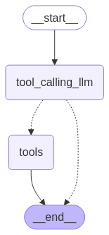
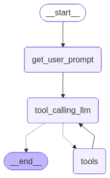

# Module-1
Module 1 specialized in the normal flow of langgraph.

## Task Completed
- Chain 
  - How to create a chain of nodesand edges

- Router
  - Added routes such that llm can go to end or make a tool_call
  - 

- Agent
  - Added decision making whether to run the llm after making a tool call or going to the END.
  - 

- Agent-Memory
  - Provided memory to the agent

## Task remaining
- Deployment (skipped for now)